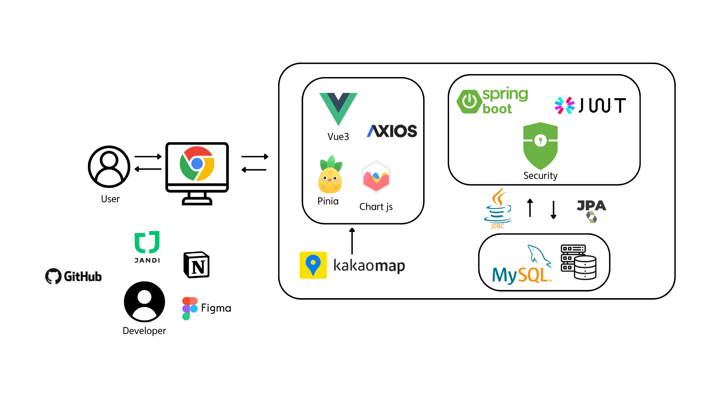
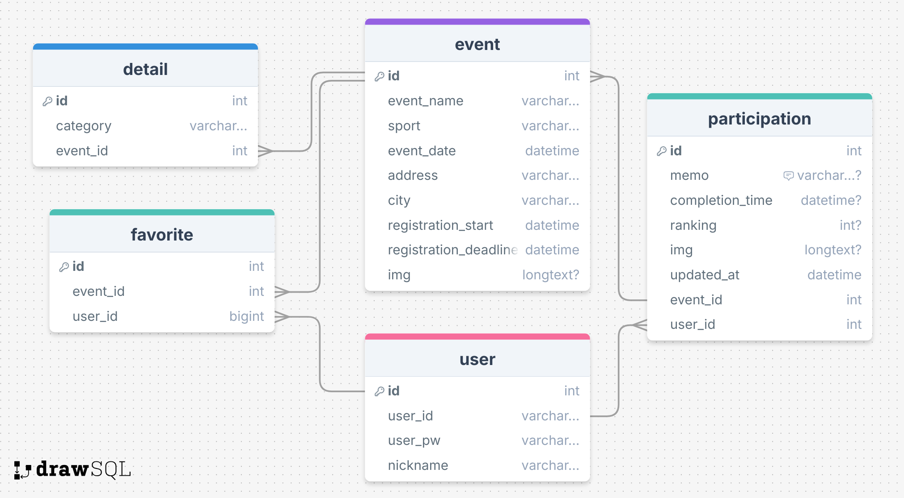
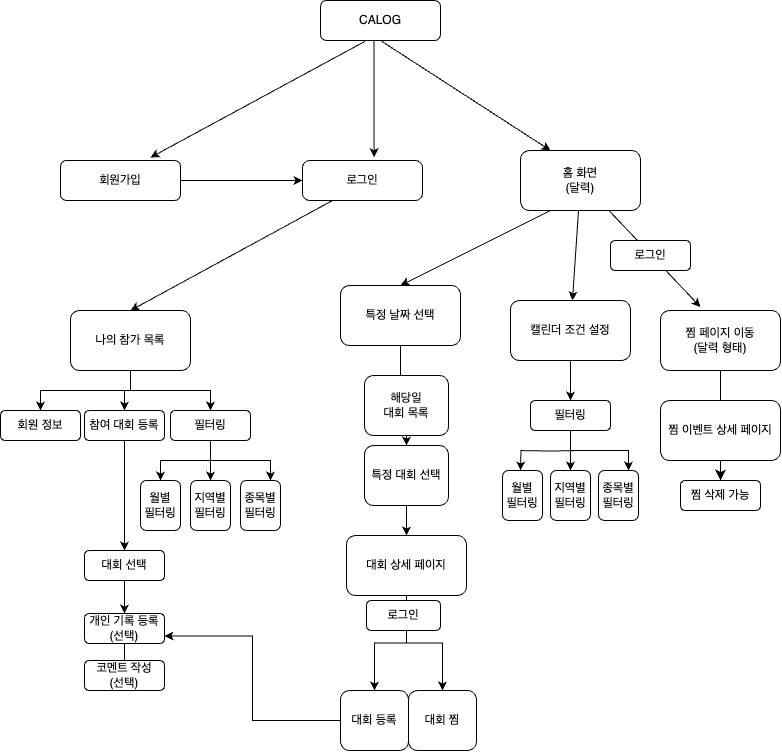

* 팀장: 김정우
* 팀원: 김혜원

### 역할 분담
- 김정우: Front-End, Documentation, PT
- 김혜원: Back-End, Figma, FE(Calendar, Modal, Favorite View)

## 1. 서비스 개요
- Calendar + Log
- 여러 아마추어 운동 대회의 일정을 캘린더 형태로 제공하고, 참가한 대회를 등록하고 관리하는 나만의 운동 대회 다이어리 어플리케이션
- 종목: 마라톤, 그랑폰도, 철인3종, 배드민턴, 테니스

### 문제상황 인식
- 종목별 운동 대회를 일일이 찾는 것에 대한 어려움 존재 + 여러 종목을 모아놓은 일정표 앱 X
- 다양한 종목에 대해 한 번에 기록/순위를 정리해두는 앱 부재

### 페르소나
#### 1. 김운동

**“운동을 다양하게 즐기고 다양한 스포츠 대회에 참가하는 운동에 미친 자”**

- 직업: 학생
- 거주지: 서울특별시 동대문구
- 취미: 러닝, 마라톤, 클라이밍, 등산, 헬스, 크로스핏
- 특징
    - 마라톤, 철인 3종, 배드민턴 대회 등 다양한 대회에 참가하고 싶지만!
    - 정신없는 현대 사회를 살아가다보면 언제 어느 대회가 시작되는지 알아보는 것도 일이야🥲
    - 다양한 종목의 대회 일정을 한 곳에서 보고 싶어! 내 시간은 소중해
    - 월별로 확인할 수 있다면! 최고!

#### 2. 박제이

**참가했던 대회들을 한데 모아 모두 기록하고 싶은 MBTI 극J형 인간**

- 직업: 대학생
- 거주지: 서울특별시
- 취미: 엽서 모으기, 일기 적기, 운동
- 특징
    - 내가 참가했던 대회 목록과 사진, 기록을 한 곳에서 저장하고 싶어!
    - 한 곳에 정리되는 것은 내 마음의 평안과 행복을 가져다주는 일

#### 3. 최남편

**주말마다 아내와 함께 지방 곳곳의 대회를 나가며 여행 겸 대회 참가를 동시에 하는 사랑꾼**

- 직업: 공무원
- 거주지: 대전광역시
- 취미: 주말마다 와이프와 운동 대회에 참가하면서 전국 여행하기
- 특징
    - 전국에 어디서 대회가 열리는지 보고 싶은데, 네이버에서 찾기가 쉽지 않네😭
    - 한 눈에 지역별 대회를 보고 싶어

## 2. 주요 내용
  
### 기술 스택


### ERD


### Flow Chart


### API 명세서


## 프로젝트 리뷰 - 김정우


### 기술 리뷰
- 완료 😎 : O
- 아직 해결 못함 😭 : △

#### Axios Chaining(O)
* db에서 외래키로 참조되는 테이블과 원본 테이블을 연결하여 데이터를 가져오기 위해
* 전체 참여 리스트 가져올 때 axios를 chaining해서 만든 후에 for문 돌면서 연결되어야 하는 값 받기 위해 요청 보내서 확인
```js
// participation.js
  // 1. 기본 참여 리스트 조회
  const getParticipationList = function () {
    axios({
      url: REST_API_URL,
      method: "get",
    })
      .then((response) => {
        // console.log("getParticipation 가져오기 완료!🔥");

        participationList.value = response.data.map((item) => ({
          ...item,
          eventDate: null,
          eventName: null,
          city: null,
          sport: null,
        }));

        // 각 참여 데이터에 이벤트 데이터 병합
        participationList.value.forEach((participation, index) => {
          axios({
            url: `${EVENT_URL}/${participation.eventId}`,
            method: "get",
          })
            .then((eventResponse) => {
              // console.log("event 정보도 추가됨! 🙂");
              const isoDate = eventResponse.data.eventDate;
              const dateObj = new Date(isoDate);
              const formattedDate = `${dateObj.getFullYear()}-${String(
                dateObj.getMonth() + 1
              ).padStart(2, "0")}-${String(dateObj.getDate()).padStart(2, "0")}`;

              participationList.value[index] = {
                ...participation,
                sport: eventResponse.data.sport,
                eventDate: formattedDate,
                eventName: eventResponse.data.eventName,
                city: eventResponse.data.city,
              };
            })
            .catch((error) => {
              console.log(
                `이벤트 정보 추가안됨. - eventId: ${participation.eventId}`
              );
            });
        });
      })
      .catch((error) => {
        console.log("getParticipationList에서 error 발생", error);
      });
  };

```

#### Promise.all을 활용한 모든 비동기 요청 병렬 처리 (O)
- 여러 개의 값 중 하나만 병합되는 이유는 비동기 처리로 인해 발생
- forEach 루프 내에서 각 axios 요청이 독립적으로 실행되므로, 비동기 요청의 완료 시점과 participationList 업데이트 간의 타이밍 이슈가 발생할 수 있음.
- `Promise.all`을 이용한 `fetchFilteredEvents()`에서의 문제 해결

#### 로그인 상태관리 (△)
```java
// Failed to load resource: the server responded with a status of 401 ()이 오류 이해하기AI
// user.js:68 로그인 상태 확인 실패: 401
// Controller와 user.js, index.js에서 모두 수정 / 디버깅해봤는데 해결 X
checkLogin과 logout에 {withCredentials: true} 설정함
```


#### Mac에서 MySQL Workbench 문제 (O)
```java
// Workbench 비밀번호 변경
팀원과 비밀번호를 맞추기 위해 비밀번호 변경하려 했으나 지웠다 다시 설치하는 방법 선택
brew로 설치하려 했으나 번번히 실패
홈페이지에서 재다운로드
곳곳에 숨어있는 MySQL 파일을 모두 지우는 것이 관건이었음

// Workbench 강제 종료 이슈
Mac을 종료하고 다시 켜니 MySQL Workbench에서 ssafy라는 connection에 들어가려 하자마자 강제 종료되어버리는 문제 발생
1. 응용프로그램에서 mysqlworkbench 삭제
2. 관련 설정파일, 캐시 삭제
    rm -rf ~/Library/Application\ Support/MySQL/Workbench
    rm -rf ~/Library/Caches/com.oracle.workbench.MySQLWorkbench
3. 홈페이지에서 8.0.38 버전으로 다운그레이드
4. 터미널에서 sudo /usr/local/mysql/support-files/mysql.server restart 
- 설정
```
* Flatpickr 라이브러리 CDN 사용 (O)

* 적절한 Google Fonts, Google Icons 사용 (O)

* Commit Convention 지키는 체계적 협업 -> 소통 및 디버깅에 긍정적 역할 (O)

* 수정 axios (O)
  * 메모, 기록, 세부종목 다 변경사항 반영된게 console.log 찍어보면 나오는데 메모 기록은 업데이트되고 세부종목은 업데이트 안되어서 계속 디버깅
  * 팀원과의 소통을 통해 백에서도 점검할 필요성을 느끼고 점검하며 오류 지점을 찾음.
  * 아래 코드에서 detail에 대한 수정도 가능하다록 변경.
    ```
    <if test="updates.img != null">
        img = #{updates.img},
    </if>
    <if test="updates.memo != null">
        memo = #{updates.memo},
    </if>
    <if test="updates.completionTime != null">
        completion_time = #{updates.completionTime},
    </if>
    <if test="updates.ranking != null">
        ranking = #{updates.ranking},
    </if>수정가능하도록 해놓은게 이것만 있어요!
    ```

#### 상세 디버깅 (O)
- `then.` `catch.` 문에 `console.log`를 통한 출력내용 확인하며 디버깅
- 개발자 도구 console을 통한 구체적 오류 확인 및 생성형 AI를 이용한 오류 내역 추적

#### 컴포넌트 활용의 중요성
- 컴포넌트로 구현하여 뷰에 적용하였으나, 하나로 만들 수 있는 컴포넌트가 여러 개로 나뉘어져있는 파일도 존재함
- 개발 초기부터 시 컴포넌트 제작에 대한 설계가 필요함을 느낌

#### 개발 전 단계 경험
- 기획 단계부터 설계, 구현, 최종 발표까지 전 단계를 경험하면서 프로젝트 역량 강화


## 프로젝트 리뷰 - 김혜원

#### CORS 설정과 allowCredentials 사용

프로젝트 초반, Spring Boot 백엔드와 Vue.js 프론트엔드 간 통신에서 CORS(Cross-Origin Resource Sharing) 관련 오류가 발생

1. 초기에는 CORS 설정을 따로 하지 않아 브라우저에서 API 요청이 차단 : 브라우저는 동일 출처 정책(Same-Origin Policy)에 따라 서로 다른 Origin 간 요청을 기본적으로 허용하지 않았습니다. 즉, 백에서 접근하는 [localhost:8080](http://localhost:8080) 포트와 프론트에서 접근했던 [localhost:5173](http://localhost:5173) 포트가 서로 달라 프론트 Origin에서 백으로의 접근이 불가했습니다.
2. CORS 정책 설정을 위해  `allowedOrigins("*”)` 를 추가했을 때는 정삭적으로 동작했지만, 이후 사용자 인증 관리를 위해  `allowCredentials(true)` 를 추가하자 오류 발생 : 오류 메세지는 allowCredentials와 allowedOrigins(”*”)가 충돌한다는 내용
    
    원인 : `allowedOrigins("*")` 은 모든 출처의 요청을 허용하지만 `allowCredentials(true)` 는 인증 정보를 포함한 요청만 허용하기 때문에 서로 발생한 문제로, 이후 인증 관리를 위해 allowedOrigins를 지우고,  allowCredentials를 사용하여 해결하였습니다.(`allowedOrigins("http://localhost:5173"),("http://localhost:8080")`)
    

#### 데이터베이스 테이블에 중복 데이터가 저장되는 문제

1. 찜 테이블 : 찜 테이블 안에 userId와 eventId가 외래키로 존재하는데 사용자가 찜 버튼을 클릭하는 순간 해당 userId와 eventId를 지닌 데이터가 추가 생성되었습니다. 그러나 동일한 사용자가 동일한 이벤트에 대해 여러 번 데이터를 insert하는 문제가 발생했습니다. PK로 찜 테이블 자체의 id를 사용하여 같은 userId와 eventId의 조합을 동일한 데이터로 인식하지 못했기 때문입니다. 이로 인해 데이터 무결성이 깨져 데이터 조회, 삭제 과정에서 오류가 발생했습니다. 이를 해결하기 위해 찜 테이블 내의 eventId와 userId 조합을 유니크 키로 두어 그 조합을 고유하게 설정하였습니다. 
2. 참여 기록 테이블 : 찜 테이블과 유사하게 참여 기록을 올리는 테이블에서도 참여 기록 테이블 자체의 id를 PK로 설정하였기 때문에 동일한 사용자가 동일한 대회에 대한 참여 기록을 올리게 되는 문제가 발생했습니다. 물론 실제 서비스 제공 시 이를 가능하게 허용할 수도 있지만, dummy data를 넣는 과정에서 불필요한 중복 데이터가 입력되는 것 같아 eventId와 userId 조합을 유니크 키로 설정한 후 데이터를 넣어 불필요한 중복을 막았습니다. 
3. 위 경우와 같이 유니크 키 설정 시 중복 데이터를 입력하려고 할 때 오류가 발생할 수 있습니다. 따라서 INSERT 전에 동일한 데이터가 존재하는지 확인하는 로직을 작성하는 것의 필요성을 느꼈습니다. 


#### JPA

jwt 구현 과정에서 mapper를 사용하지 않고, JPA를 활용하여 user entity를 생성하고 관리하는 방법을 구현했습니다. 이를 통해 객체 지향적인 설계와 효율적인 데이터 관리를 체감할 수 있었습니다. 매퍼를 하나하나 세세하게 작성하는 것이 아니라 JPA 리포지토리를 활용하여 데이터를 조작하는 등 간결하게 작성할 수 있었습니다. 또한 도메인 중심 설계의 장점을 알게 되었습니다. 기존에는 JDBC를 활용한 테이블 설계 방식을 택하여 보다 직관적인 이해가 가능했지만, 엔티티 클래스를 활용한 도메인 중심 설계를 하며, 비즈니스 로직을 중심으로 데이터를 다루는 경험을 했습니다(기존의 데이터를 처리하는 방식에 초점을 맞춘 것과 차이가 있습니다). 그러나 아직 도메인 중심 설계에 어려움이 많고, 추상적으로 이해하고 있기 때문에 이에 대한 공부의 필요성을 느꼈습니다. 그러나 코드의 유연성과 확장성이 늘어나는 장점이 무엇인지를 확실하게 체감했습니다.

#### Annotation

다양한 Annotation의 존재와 필요성을 느끼게 되었습니다.  어노테이션은 사전적 의미로는 주석이란 뜻이지만, Java에서 Annotation(@)는 코드에서 특별한 의미로, 기능을 수행하도록 소스 코드에 추가해서 사용할 수 있는 메타 데이터의 일종입니다. 여기서 메타 데이터란 애플리케이션이 처리해야 할 데이터가 아니라 컴파일 및 런타임 과정에서 코드를 어떻게 처리해야 할 지 알려주기 위한 추가 정보라는 것을 개달았습니다. 즉, 어노테이션을 적용한 부분의 역할이 무엇인지 알려주고 설정하는 로드맵과 같은 느낌으로 이해했습니다. 

특히, 여러 DTO 클래스를 작성하며 반복 작업을 진행하며 불편함을 느꼈습니다. 매번 직접 다양한 종류의 생성자를 작성하며 시간 소모를 했고 이 과정에서 반복 작업을 줄이기 위해 찾아본 Annotation @NoArgsConstructor과 @AllArgsConstructor입니다. 또한 Lombok 라이브러리에 대한 문서를 찾아보았습니다. 이미 개발을 완료하여 이를 적용하지 못했지만 이처럼 개발자의 편리를 위해 반복 작업하는 과정을 생략해주는 어노테이션이 많다는 것을 느꼈습니다. 그러나 무작정 다양한 어노테이션을 다 적용하기보단 내 개발에 필요한 어노테이션을 골라서 적용하고, 체크해야 한다는 것을 느꼈습니다.

#### 필터링 SQL 작성

대회들에 대해 여러 가지 필터를 걸며, 필터들을 중복 체크하는 경우와 그렇지 않은 경우에 대해 (필터 개수)^2개의 sql문을 작성했습니다. 작성하며 무언가 불편함을 느끼고 마지막 sql문을 작성하던 중 하나의 sql로 처리할 수 있음을 깨달았습니다. if문을 활용하여 해당 필터 값이 null이 아닐 경우 그 필터를 적용하는 것이 해결책이었습니다. 이를 뒤늦게 깨달아 아쉬움이 많았지만, sql 작성의 시야가 트이는 경험을 했습니다. 

#### 다양한 다이어그램 작성과 계획서의 필요성

본격적인 개발에 들어가기 앞서 다양한 계획서와 다이어그램, 피그마를 작성하며 로드맵 삼았습니다. 실제 개발만큼이나 이 과정에 많은 시간을 들였습니다. 선생님께서는 코드를 치는 시간보다 고민하고, 계획하는 단계에 시간을 많이 써야 한다고 하셨고, 이 말씀에 따라 더 집중하여 계획을 준비했습니다. 이후 코드를 작성하는 단계에 접어 들자 조급함이 들기도 했지만 실제 코드를 치는 시간에 들어서는 계획 덕에 시간을 크게 단축했습니다. 직접 프로젝트를 구상하고 설계하며 어려움이 많았지만 구상과 계획에 공을 들인 덕에 보다 안정적으로 개발할 수 있었습니다. 이후에 프로젝트를 진행하게 된다면 꼭 필요한 기능들을 미리 테스트로 구현(TDD)하며 진행해보고 싶다는 생각을 했습니다.